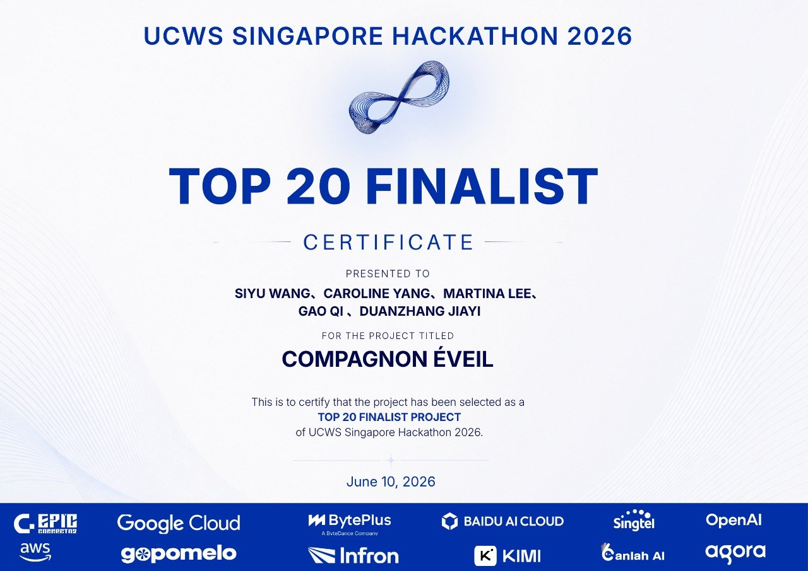

<p align="center">
  
</p>

<h1 align="center">Yorimi</h1>

<p align="center">
  <strong>Be there. Every day.</strong>
</p>

<p align="center">
  <strong>AI character presence layer for digital culture</strong><br />
  Memory-driven persona intelligence, creator IP interaction, study companionship, and 3D desktop embodiment.
</p>

<p align="center">
  <a href="https://compagnon-eveil.vercel.app/">Live Demo</a>
  |
  <a href="#english">English</a>
  |
  <a href="#中文">中文</a>
  |
  <a href="#wave-1-submission-docs">Wave 1 Specs</a>
  |
  <a href="#team--founders">Founders</a>
</p>

<p align="center">
  
  
  
  
</p>

---

## English

### One-Line Pitch

**Yorimi is building the AI presence layer for digital characters, giving virtual IPs memory, agency, and real-world 3D desktop embodiment beyond the screen.**

### What Is Yorimi?

Yorimi is an AI character presence product that combines:

- AI character interaction
- Long-term memory and session context
- Voice and emotional state feedback
- Study, work, routine, and daily companionship
- Creator IP interaction through Creator Studio
- 3D desktop companion device presentation

It is designed for ACGN users, VTuber communities, indie game IPs, original character creators, and young users who want study and daily companionship. Yorimi fits the **Digital Culture** track as an **AI+Entertainment / AI+Education** application.

### Why The Demo Link Says Compagnon Éveil

Yorimi was previously named **Compagnon Éveil**. The current deployed technical prototype still uses the predecessor deployment domain:

```text
https://compagnon-eveil.vercel.app/
```

The product identity, Wave 1 submission, and future roadmap are now Yorimi.

### Product Experience

Users create or select an AI companion: an original anime-style character, study companion, VTuber character, indie game character, or digital pet. Each character can have personality, voice interaction, memory, skins, and expressive states.

When the user feels stuck, low-energy, or unable to start, Yorimi responds gently first, then guides one concrete action such as a daily check-in, a 10-minute study sprint, or a task-start reminder.

Unlike a normal chatbot, Yorimi also has a **3D desktop companion device demo**. The character can appear on a physical desktop display with expressions, motion, and status, turning virtual characters into companions with real-world presence.

### Creator Studio

Yorimi will provide Creator Studio for VTubers, illustrators, indie game teams, and original IP creators. Creators can upload character settings, worldview boundaries, tone samples, voice, and skins, turning their characters into interactive, operable, displayable, and monetizable AI character services.

### Current Status

Wave 1 is focused on clear product specs: application scenarios, business logic, executable requirements, and evaluation criteria.

Current repository includes:

- Deployed Web runtime prototype
- OpenAI runtime adapter
- Schema-compatible fallback behavior
- Voice fallback
- Session and lightweight memory logic
- Companion assets
- 3D desktop device demo assets
- Chinese and English submission documents

This is not yet a complete commercial product. Wave 2 will turn the current runtime into a Yorimi-branded MVP.

## Wave 1 Submission Docs

Submission folder: [docs/submission/opc-2026-wave1](./docs/submission/opc-2026-wave1)

| Chinese | English | Purpose |
| --- | --- | --- |
| [01_项目说明文档.md](./docs/submission/opc-2026-wave1/zh/01_项目说明文档.md) | [01_Project_Specification_EN.md](./docs/submission/opc-2026-wave1/en/01_Project_Specification_EN.md) | Product specs, scenarios, requirements, evaluation criteria |
| [02_代码运行说明.md](./docs/submission/opc-2026-wave1/zh/02_代码运行说明.md) | [02_Run_Instructions_EN.md](./docs/submission/opc-2026-wave1/en/02_Run_Instructions_EN.md) | Local run instructions and hardware demo evidence |
| [03_技术与产品架构说明.md](./docs/submission/opc-2026-wave1/zh/03_技术与产品架构说明.md) | [03_Technical_Product_Architecture_EN.md](./docs/submission/opc-2026-wave1/en/03_Technical_Product_Architecture_EN.md) | Technical and product architecture |
| [04_未来规划.md](./docs/submission/opc-2026-wave1/zh/04_未来规划.md) | [04_Roadmap_EN.md](./docs/submission/opc-2026-wave1/en/04_Roadmap_EN.md) | Wave 2/3/4 roadmap, validation, commercialization |

## Demo

- Live Web demo: https://compagnon-eveil.vercel.app/
- Local route: `http://127.0.0.1:3017/nextstep-companion.html`
- Device demo assets: [assets](./assets)

The local route keeps the predecessor filename for deployment compatibility. Yorimi is the current product identity.

## Run Locally

```powershell
npm install
Copy-Item .env.example .env
npm run dev
```

Open:

```text
http://127.0.0.1:3017/nextstep-companion.html
```

For live AI, set:

```env
OPENAI_API_KEY=your_key_here
USE_MOCK_AI=false
```

Without `OPENAI_API_KEY`, the backend uses schema-compatible fallback for frontend rendering and failure-handling tests. Real character quality should be evaluated with OpenAI configured.

## Team / Founders

**Siyu Wang（王斯昱）** is the founder and Product/Business Lead of Yorimi. He studies in the ESSEC Business School Global BBA program with the ESSEC Excellence Scholarship. He has worked on Mercor AI consulting and generative AI model evaluation, independently handled market research and data analysis at Yunnan Yunda Coffee, and led a team into L'Oréal Brandstorm 2026 Hong Kong Top 50. He leads Yorimi's product direction, AI character experience, market positioning, and business strategy.

**Martina Lee** is Yorimi's cofounder and AI Engineering/Research Lead. Martina is Singaporean Chinese and is pursuing a Physics PhD at Nanyang Technological University, working across Physics x AI research and AI engineering. Martina and Siyu met through hackathon collaboration and have continued building together. They brought Yorimi's predecessor, Compagnon Éveil, into the UCWS Singapore Hackathon 2026 Top 20.

## Award / Early Recognition

Yorimi's predecessor project **Compagnon Éveil** was selected as a **UCWS Singapore Hackathon 2026 Top 20 Finalist**. This recognition is the proof point behind Yorimi's current direction: AI character presence for digital culture, creator IP, study companionship, and 3D desktop embodiment.

<p align="center">
  
  <br />
  <sub>Proof of recognition: UCWS Singapore Hackathon 2026 Top 20 Finalist certificate for Compagnon Éveil, Yorimi's predecessor project.</sub>
</p>

## 中文

### 一句话介绍

**Yorimi 是面向数字文化赛道的 AI 角色存在系统，把虚拟 IP 从“被观看的内容”升级为有记忆、有互动、有桌面在场感的 AI companion。**

### 项目定位

Yorimi 是一款结合 **AI 角色互动系统** 与 **3D 桌面陪伴设备** 的 AI 角色存在产品，面向 ACGN、VTuber、独立游戏 IP、原创角色创作者与年轻用户，属于数字文化赛道的 **AI+文娱 / AI+教育** 应用。

用户可以创建或选择一个 AI companion，例如原创二次元角色、学习陪伴角色、VTuber 角色、独立游戏角色或数字宠物。角色具备可对话的性格、语音互动、长期记忆、角色皮肤与情绪化表达，能在学习、工作和日常生活中提供陪伴、提醒、鼓励与轻量行动引导。

当用户感到低动力、拖延或难以开始时，Yorimi 会先温和回应，再引导用户完成一个具体的小行动，例如每日 check-in、10 分钟学习专注或任务开始提醒。

### 3D 桌面在场

与传统 AI 聊天工具不同，Yorimi 不止于文字回复。我们已经制作了 **3D 桌面陪伴设备 Demo**，让角色在桌面设备上展示表情、动作与状态，赋予虚拟角色现实存在感。它把 AI 对话、角色设定、长期记忆、视觉形象、桌面展示与陪伴场景结合起来，让虚拟角色成为有持续互动价值的数字伙伴。

### 创作者端

Yorimi 将提供 Creator Studio，支持 VTuber、画师、独立游戏团队与原创 IP 创作者上传角色设定、世界观边界、语气风格、语音与皮肤，把自己的角色转化为可互动、可运营、可展示、可商业化的 AI 角色服务。

### 当前阶段

本阶段项目仓库包含产品说明、代码运行说明、技术与产品架构、未来规划、团队介绍、线上技术原型与 3D 桌面设备展示素材。Yorimi 的前身项目 **Compagnon Éveil** 曾入选 **UCWS Singapore Hackathon 2026 Top 20 Finalist**；当前我们正基于前期 Demo 与反馈，将项目进一步升级为定位更清晰的 AI 角色存在产品。

### 团队

**Siyu Wang（王斯昱）** 是 Yorimi 的发起人，主导产品与商业，就读于 ESSEC Business School Global BBA（ESSEC Excellence Scholarship）。他曾任 Mercor AI 咨询与生成式 AI 模型评估，并在 Yunnan Yunda Coffee 独立负责市场调研与数据分析；作为队长入围 L'Oréal Brandstorm 2026 香港赛区 Top 50。目前负责 Yorimi 的产品方向、AI 角色体验、市场定位与商业策略。

**Martina Lee** 是 Yorimi cofounder，Singaporean Chinese，目前在 Nanyang Technological University 攻读 Physics PhD，研究方向横跨 Physics x AI，同时负责 AI engineering 与技术实现。Martina 与 Siyu 通过 hackathon 合作相识，并持续协作推进 Yorimi；两人共同将 Yorimi 前身 Compagnon Éveil 带入 UCWS Singapore Hackathon 2026 Top 20。

## References

- [AI HoloBox](https://www.aiholobox.com/) - holographic desktop AI companion reference.
- [Global Market Insights: Holographic Display Market](https://www.gminsights.com/industry-analysis/holographic-display-market) - holographic display market forecast.
- [Gatebox](https://www.gatebox.ai/) - virtual character companion device category reference.
