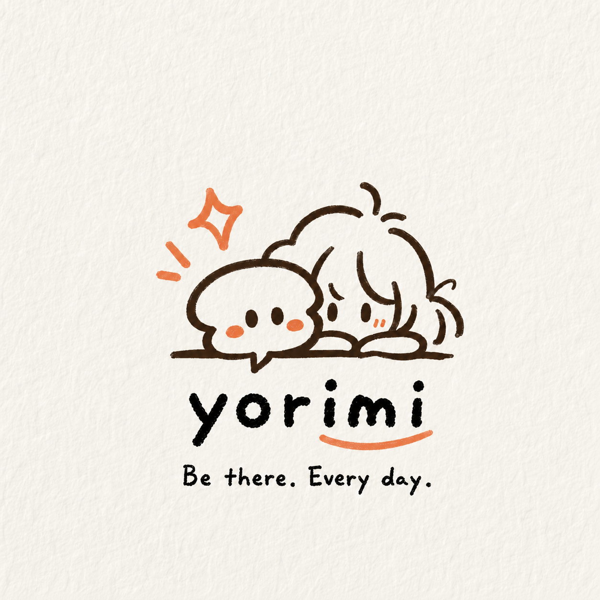

# Yorimi Technical and Product Architecture

<p align="center">
  
</p>

Yorimi is not only a chatbot. It is a system for persona setup, ongoing interaction, user memory, action companionship, desktop display, and planned creator-side character operation.

## 1. Architecture Overview

```text
User / Fan / Creator
        |
        v
Web Runtime / App Experience
        |
        v
AI Character System
  - persona profile
  - tone control
  - scenario detection
  - response generation
  - emotion/state output
        |
        +--> Memory Layer
        +--> Micro-Action Layer
        +--> Safety / IP Layer
        |
        v
Avatar / 3D Desktop Presence Layer
        |
        v
Planned Creator Studio
```

## 2. Current Implementation

The current repository contains a working runtime prototype inherited from the predecessor project and now positioned as Yorimi's technical baseline.

| Layer | Current Implementation |
| --- | --- |
| Frontend | Standalone HTML demo served from `frontend/static/nextstep-companion.html` |
| Source mirror | Categorized React/TypeScript source under `frontend/companion-experience/` |
| Server | Local Node server in `server/index.js` |
| API | Shared handlers in `server/http/runtimeHandlers.js` and Vercel `.mjs` wrappers |
| AI runtime | OpenAI adapter in `server/engines/openai/` |
| Fallback | Schema-compatible mock fallback in `server/engines/mock/` |
| Memory | In-memory session and memory store |
| Voice | Fish Audio proxy with browser `speechSynthesis` fallback |
| Static assets | Companion images and device-state videos under `assets/` |

The static filename still includes `nextstep-companion` for deployment and test compatibility. The product identity and Wave 1 submission are Yorimi.

## 3. AI Character System

Each character has:

- Name and role.
- Personality and tone.
- Use case, such as study, daily companionship, creator IP interaction, or digital pet.
- Visual skin and expression/state mapping.
- Boundary rules for persona consistency, safety, and IP control.

The runtime uses the latest user message, selected scenario, tone, role, use case, companion profile, recent history, and memory to generate a structured response.

Important output fields:

- `answer` and `reply`
- `intent`
- `mode`
- `companion_state`
- `suggested_actions`
- `micro_task_plan`
- `memory`
- `fallback_used`

The frontend must render `answer || reply` as the visible assistant message. `micro_task_plan` is supporting UI, not the main answer.

## 4. Memory Layer

Yorimi uses memory to turn one-time chat into a continuing relationship. Memory can include:

- Character memory: persona, world, tone, boundaries.
- User memory: preferences, name, study style, useful support patterns.
- Session memory: recent conversation context.
- Action memory: completed actions, check-ins, blockers.

Wave 1 uses lightweight memory behavior and architecture definition. Wave 2 targets more robust memory display, editing, deletion, and cross-session recall.

## 5. Companion-to-Action Layer

Yorimi's key product behavior is "companionship to action":

```text
User feels stuck
-> Yorimi responds gently
-> system detects low motivation or task-start state
-> Yorimi suggests one concrete first action
-> user enters a short sprint or check-in
-> memory is updated
```

This is especially important for study, work, daily routines, and emotional friction around starting tasks.

## 6. 3D Desktop Device Layer

Current state:

- Physical 3D desktop display demo exists.
- Device can show preset character expressions, motions, and states.
- Assets include idle, thinking, reminder, focus, jump, and confused states.

Wave 2/3 target:

- Connect Web/App state to the device through a Device Bridge.
- Support state-driven display, expression switching, and later local network/Bluetooth/WebSocket synchronization.

## 7. Planned Creator Studio Layer

Creator Studio is the planned creator-side product surface for VTubers, illustrators, indie game teams, and original IP owners. It is a Wave 2/3 prototype target, not a shipped feature in the current Wave 1 runtime.

Planned modules:

- Character profile.
- Lore and worldview.
- Boundary rules.
- Tone samples and fan naming.
- Visual skins and voice assets.
- Fan interactions and limited events.
- Analytics and monetization.

## 8. Wave 2 Extension Targets

- Rebrand the runtime UI into Yorimi.
- Add stronger persona consistency.
- Add persistent memory storage.
- Build Creator Studio prototype.
- Add richer expression/state mapping.
- Add device bridge prototype.
- Prepare demo video and user testing flow.

## 9. Engineering Acceptance Criteria

| Module | Acceptance Criteria |
| --- | --- |
| Dialogue | Replies follow selected character profile and tone |
| Intent/state detection | Study, low motivation, routine, and companion states are classified usefully |
| Action guidance | Low-motivation inputs receive one small concrete action |
| Memory | Summary is written and can influence later turns |
| Rendering | Visible bubble uses `answer || reply` |
| Fallback | Mock only appears when OpenAI is missing/failing or explicitly forced |
| Voice | Missing Fish Audio does not block chat or browser voice fallback |
| Device | Physical demo can show the presence concept; realtime sync is a later target |
